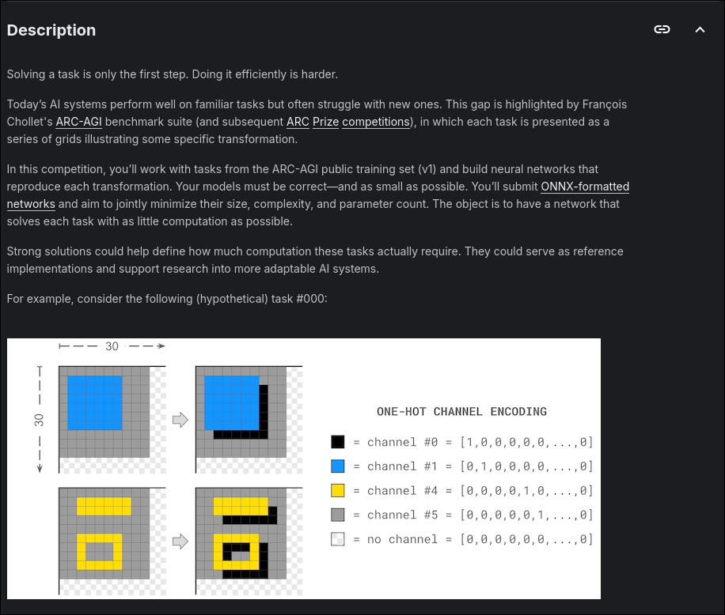

# Problem Statement



Yea that's about it, /tasks has the [official dataset](https://www.kaggle.com/competitions/neurogolf-2026/data)

You can bypass all that by just downloading via pip itself but if you are actively contributing to this repository, it kinda defeats the purpose so ...

anyways:

```bash
kaggle competitions download -c neurogolf-2026
```

or

```bash
kagglehub.competition_download('neurogolf-2026')
```

make sure to have a kaggle.json in your dotfiles or else rip.

## Contribution Guidelines

Please refer to [this](https://github.com/PranavU-Coder/neuroGolf?tab=contributing-ov-file)

## License

MIT
